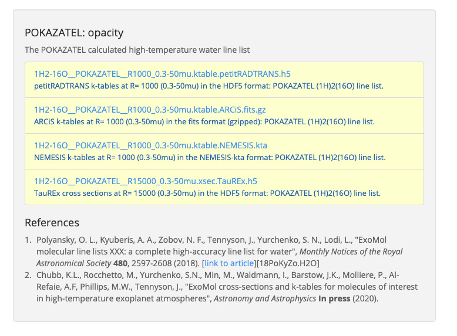

================
Adding opacities
================

petitRADTRANS has an extensive database of line opacities. However, it is very
likely that we are missing the one atom / molecule that you want.
There are three options for adding external opacities to petitRADTRANS:

1. :ref:`ExoMolpRT`. These are already in the petitRADTRANS format and can be used in a plug-and-play fashion. The opacities are available for the low-resolution mode of petitRADTRANS only (:math:`\lambda/\Delta\lambda=1000`).
2. :ref:`OWtopRT`.
3. :ref:`Calculating opacities from line lists yourself<ECtopRT>`, and converting them to the petitRADTRANS format.

These different options are explained in more detail below.

If you add opacities which are not available through the Exomol website with Option 2 or 3, and if you are
particularly nice, you can share these opacities with us. We would then
make them available to the other petitRADTRANS users via this website, while properly
attributing your contribution.

.. _ExoMolpRT:

-------------------------------------------------------------
 Importing custom-made opacity tables from the Exomol website
-------------------------------------------------------------

The linelists available on the `Exomol website <http://www.exomol.com>`_ were recently converted into opacity tables in the custom format of various retrieval codes, see `Chubb et al. (2020) <https://arxiv.org/abs/2009.00687>`_. Opacity tables in the petitRADTRANS can be downloaded `on this page of the Exomol website <http://www.exomol.com/data/data-types/opacity/>`_. These opacity grids have been calculated for temperatures ranging from 100 to 3400 K (:math:`\Delta T = 100 \ {\rm K}` for :math:`T \in [100-2000] \ {\rm K}` and :math:`\Delta T = 200 \ {\rm K}` for :math:`T \in [2000-3400] \ {\rm K}`) and 22 pressure points spaced equidistantly in log-space, from :math:`10^{-5}` to 100 bar. Thermal and pressure broadening have also been included, see `Chubb et al. (2020) <https://arxiv.org/abs/2009.00687>`_ for more information. If you use petitRADTRANS at pressures and temperatures outside of this grid, petitRADTRANS will use the opacity at the gridpoint closest to the pressure and temperature specified in your calculation. These Exomol grids, in the hdf5 format, can simply be dropped into the opacity folder of petitRADTRANS to use them. **This is arguably the easiest option to install external opacities, which we always recommend, if the species of interest is available from Exomol.** Note that Exomol tables are available for the low-resolution mode of petitRADTRANS only (:math:`\lambda/\Delta\lambda=1000`). The installation is outlined below.

1. In this example we will look at the Exomol `POKAZATEL <https://academic.oup.com/mnras/article/480/2/2597/5054049>`_ line list for water.
   Navigate `to its entry <http://www.exomol.com/data/molecules/H2O/1H2-16O/POKAZATEL/>`_ on the Exomol website and scroll to the bottom of the page to the "POKAZATEL: opacity" section (see screenshot). Click on the link to download the petitRADTRANS opacity table.

2. Navigate to your petitRADTRANS opacity folder, which is the ``path to input_data/opacities/lines/corr_k/`` folder.
Make a new folder called, for example, ``H2O_Chubb`` and place the ``1H2-16O__POKAZATEL__R1000_0.3-50mu.ktable.petitRADTRANS.h5`` file inside.

You're done! pRT will check automatically if an ``*.h5`` file is in the opacity folder, so as long as you keep the ``.h5`` extension, the file in the ``H2O_Chubb`` folder can be called whatever you like, as long as it begins with the correct chemical formula for that species. The name of the folder, which we chose to be ``H2O_Chubb`` here, can also be anything. After dropping the ``.h5`` file in the ``H2O_Chubb`` folder, the opacity species ``H2O_Chubb`` is now ready for use! Note that also the abundances must be specified for ``H2O_Chubb`` when using petitRADTRANS with this opacity table.

.. _OWtopRT:

-------------------------------------------------------------------
Converting cross-section grids from `DACE`_
-------------------------------------------------------------------

Pre-computed opacities are also available from `DACE`_,
which have been generated using the method presented in `Grimm & Heng
(2015) <https://iopscience.iop.org/article/10.1088/0004-637X/808/2/182>`_ .
The DACE opacity database itself is described in
`Grimm et al. (2021) <https://ui.adsabs.harvard.edu/abs/2021ApJS..253...30G/abstract>`_.
The website allows to download the cross-section tables as a function
of pressure and temperature.

Simply decide on any P-T range line list that you are interested
in. Note that their spectral coordinate is wavenumber, in units of
:math:`{\rm cm}^{-1}`.

Then transform the resulting binary files, that you downloaded from
`DACE`_, like described in the following. This script was
developed together with Mantas Zilinskas, for `Ziliniskas et
al. (2020) <https://arxiv.org/abs/2003.05354>`_.

First we load the relevant packages.

.. code-block:: python

        import numpy as np
        import struct
        import glob
        from scipy.interpolate import interp1d
        import math
        import sys

Then we define where the input file are and where ouput files are
supposed to be put. This example here is for the H2O opacity.

.. code-block:: python

		# Paths to DACE files and output directory (ADJUST ACCORDINGLY)
        path_to_files = '../1H2-16O__POKAZATEL_e2b/'
        path_to_output = '../1H2-16O__POKAZATEL_e2b/'
        filelist = glob.glob(path_to_files+'Out*')  # Find all opacity world files in the directory

DACE saves the opacities in units of :math:`{\rm cm}^{2}{\rm
g}^{-1}`, but the petitRADTRANS conversions scripts need :math:`{\rm
cm}^{2}`. So we will have to convert below. For this it is important
that the mass of the absorber species is defined, in units of
amu. **Do not forget to adapt this for every new species!**

.. code-block:: python

		# Properties of chosen species
		species_mass = 18.

This function below will read the binary files downloaded from
`DACE`_:

.. code-block:: python

		def read_bin_single(filename):
		    """ Read a binary opacity world file.
		    """

		    # Open file
		    file = open(filename,mode='rb')
		    # Read content
		    cont = file.read()
		    file.close()

		    # The number of bytes per entry is 4
		    # Get the number of datapoints
		    points = int(len(cont)/4)
		    # Create array of the appropriate length
		    x = np.ones(points)

		    # Read the binary data into the array
		    for i in range(int(points)):
    		        test = struct.unpack('f',cont[i*4:(i+1)*4])
			x[i] = test[0]

		    return x

Finally we define the function that reads the binary `DACE`_
files, and saves them in the format that can be used by the opacity input
generating scripts of petitRADTRANS. For this you also need the file
that defines the petitRADTRANS wavelength grid, which can be
downloaded here: `wlen_petitRADTRANS.dat`_

.. code-block:: python

    def convert():

        """ Converts opacity.world binary files for further pRT processing
        """

        # Read the fiducial petitRADTRANS wavelength grid
        wavelength_petit = np.genfromtxt('wlen_petitRADTRANS.dat')

        for file in filelist:

            # Reads oworld file
            opa = read_bin_single(path_to_files + file)

            # Temp and pressure for naming files
            t = str(int(file.split('/')[-1].split('_')[3]))
            p = str(file.split('/')[-1].split('_')[4].split('.bin')[0].replace('n','-').replace('p',' '))
            p = p[:2] + '.' + p[2:]
            p = str(np.round(1e1**float(p), 6))
            print (t,p)

            # Wavenumber points from range given in the file names
            wl_start = int(file.split('/')[-1].split('_')[1])
            wl_end = int(file.split('/')[-1].split('_')[2])
            wlen = np.linspace(wl_start, wl_end, len(opa))
            # Convert to cm or [micron]
            wavelength = 1./wlen#/1e-4

            # Invert them to go from a accending wavenumber ordering
            # to an accending wavelength ordering.
            wavelength = wavelength[::-1]
            sigma = opa[::-1]

            # OW opacities cm^2/g, convert to cm^2 by *species_mass*amu
            sigma = sigma*species_mass*1.66053892e-24

            # Interpolate
            sig_interp = interp1d(wavelength, sigma,bounds_error=False,fill_value=0.0)
            sig_interpolated_petit = sig_interp(wavelength_petit)

            # Check if interp values are below 0 or NaN
            for i in sig_interpolated_petit:
                if i < 0.:
                    print (i)
                elif math.isnan(i):
                    print (i)

            #### SAVING REBINNED #### Around 300 MB per grid point
            # New file name is 'sigma_+ temp + .K_ + Pressure + bar.dat'
            np.savetxt(path_to_output + 'sigma_' + str(t) + '.K_' + str(p) + 'bar.dat',
                       np.column_stack((wavelength_petit, sig_interpolated_petit)))

Then you just need to start the conversion:

.. code-block:: python

		convert()

Finally, these input files need to be converted to petitRADTRANS
k-tables. This is done in an analogous way as explained in Section
:ref:`EXtopPRT` below. When doing this, note that you can omit the step rebinning the cross-section
files to the petitRADTRANS wavelength grid, because this was already
done in ``convert()`` above!

.. _DACE: https://dace.unige.ch/opacityDatabase/

The opacities can then be installed as described in Section
:ref:`install` below.

.. _ECtopRT:

---------------------------------------------
From line lists to opacities (using ExoCross)
---------------------------------------------

Before we can use it, any line list needs to be converted into actual opacities.
In this example we will show you how to do this using ExoCross, the
open-source opacity calculator of the `Exomol`_ database.
ExoCross can be downloaded `here <https://github.com/Trovemaster/exocross>`_, is described in
`Yurchenko et al. (2018)`_ and documented `here
<https://exocross.readthedocs.io>`_.

.. _Exomol: http://www.exomol.com
.. _Yurchenko et al. (2018): https://arxiv.org/abs/1801.09803

First, download the ExoCross source, go into the folder containing the
source and the makefile called "makefile". Adapt that to your liking.
For example, if you have the gfortran compiler, but not ifort, make
sure that the flag using ifort is commented out, and that it uses
gfortran. The relevant lines in "makefile" should look like this:

.. code-block:: bash

    #FOR  = ifort
    #FFLAGS =  -O3 -qopenmp -traceback  -ip
    FOR = gfortran
    FFLAGS = -O2 -fopenmp -std=f2008

Then, build ExoCross by typing ``make`` in the terminal. Sometimes the compiler will
complain that lines within the ExoCross source are too long. Just open
the source and introduce a line break there manually, like this:

.. code-block:: fortran

    ! This is an example for a line that is too long
    DOUBLE PRECISION :: very_long_variable_name_number_one, very_long_variable_name_number_two, very_long_variable_name_number_three

    ! This is how you introduce line breaks
    DOUBLE PRECISION :: very_long_variable_name_number_one, &
       very_long_variable_name_number_two, &
       very_long_variable_name_number_three

So the ``&`` is th line break operator. After fixing this, recompile
using ``make``.

In this example we will calculate the opacities of the NaH molecule.
All necessary files for calculating opacities can be found on the Exomol
website, just `click here`_.

.. _click here: http://www.exomol.com/data/molecules/NaH/23Na-1H/Rivlin/

The following files need to be downloaded:

- 23Na-1H__Rivlin.states.bz2
- 23Na-1H__Rivlin.trans.bz2
- 23Na-1H__Rivlin.pf

Please unzip the .bz2 files before use.

Next, make an input file for carrying out the calculations, in this
example we call it NaH_input.inp. This is what it looks like:

.. code-block:: bash

    absorption
    voigt
    verbose 3
    offset 60.
    mass 24
    temperature 1000.000000
    pressure 0.00001
    range 39. 91000.
    R 1000000
    pffile 23Na-1H__Rivlin.pf
    output NaH_1000K_1em5bar.out
    states 23Na-1H__Rivlin.states
    transitions
      "23Na-1H__Rivlin.trans"
    end
    species
      0 gamma 0.06 n 0.5 t0 296 ratio 1.
    end

This calculates the opacity of NaH with the following settings

- ``offset `` results in a line cutoff of 60 :math:`{\rm
  cm}^{-1}`. While being an important effect that also speeds up
  calculations, the choice of a cutoff is often arbitrary because the
  physics behind it remain difficult to model, see, for example the
  discussion in `Grimm & Heng
  (2015)`_. Here we use the equivalent width of the line decrease
  function given by `Hartmann et al. (2002)`_, for :math:`\rm CH_4`
  broadened by :math:`\rm H_2`.
- NaH has a mass of 24 (in amu)
- The opacity is calculated at a temperature of 1000 K
- The opacity is calculated at a pressure of :math:`10^{-5}` bar
- The opacity is calculated in the range from 39 to 91000 :math:`{\rm
  cm}^{-1}`. This corresponds to a wavelength range from 0.1099 to
  256.4103 micron, therefore bracketing the full petitRADTRANS
  wavelength range (0.11 to 250 micron at low resolution). This large
  a range is needed. Therefore, do not change this. Note that the opacities in
  the high-resolution mode of petitRADTRANS ultimately only go from
  0.3 to 28 microns.
- The resolution of the calculations carried out here is for a
  wavelength spacing of :math:`\lambda/\Delta\lambda=10^6`.
- The ``pfile`` line gives the relative path to the partition function
  file, that you have already downloaded from Exomol.
- The ``states`` line gives the relative path to the states
  file, that you have already downloaded from Exomol.
- The lines below ``transitions`` line give the relative paths to the transition
  files, that you have already downloaded from Exomol. For NaH this is
  only one file. For molecules with a lot more lines this can be
  multiple files.
- The lines below ``species`` define the pressure broadening to be
  used. This pressure boradening (width of the Lorentz profile) is of
  the form :math:`\gamma \cdot (T_{0}/T)^n ({\rm ratio}\cdot
  P/{\rm 1 \ bar})`, in units of :math:`\rm cm^{-1}`.  The choice here is a compromise between the
  various values reported for the broadening by :math:`\rm H_2/He` of
  various absorbers, e.g. in `Amundsen et al. (2014)`_, `Gharib-Nezhad &
  Line (2018)`_. Also see the text around Equation 12 in `Sharp &
  Burrows (2007)`_ for more information. Sometimes more detailed
  broadening information is available on Exomol, `see here`_.

.. _Hartmann et al. (2002): http://adsabs.harvard.edu/abs/2002JQSRT..72..117H
.. _Grimm & Heng (2015): https://arxiv.org/abs/1503.03806
.. _Amundsen et al. (2014): https://arxiv.org/abs/1402.0814
.. _Gharib-Nezhad & Line (2018): https://arxiv.org/abs/1809.02548v2
.. _Sharp & Burrows (2007): https://arxiv.org/abs/astro-ph/0607211
.. _see here: http://www.exomol.com/data/data-types/broadening_coefficients/

If more detailed broadening information is avaiable (not for NaH) you can replace
the lines below ``species`` with something like

.. code-block:: bash

    species
      0 gamma 0.06 n 0.5 t0 296 file path_toH2_broadening_information_file model J ratio 0.860000
      1 gamma 0.06 n 0.5 t0 296 file path_toHe_broadening_information_file model J ratio 0.140000
    end

The above setting is for a primordial composition atmosphere, where
:math:`\rm H_2` and He roughly make up 86 % and 14 % of the
atmosphere, respectively (i.e. these are volume mixing ratios, not
mass fractions). The :math:`\gamma` and :math:`n` values given before
the path to the boradening files are what is used for rotational
quantum numbers (:math:`J`) not covered by the broadening files.

Finally, the opacities are calculated by running ExoCross from the
terminal command line via

.. code-block:: bash

     ./xcross.exe < NaH_input.inp > test_run.out

The resulting wavelength-dependent opacity will be in the "NaH_1000K_1em5bar.out.xsec" file, in our
example here.
In the end quite a few opacity points need to be calculated for
petitRADTRANS (for example at 130 or 200 different pressure-temperature
conbinations, see below). This is doable on a local machine for smaller
linelists such as NaH, but may require the use of a cluster for much
larger linelists. There also exsists the so-called superline
treatment `(see Yurchenko et al. 2018)`_
, where multiple lines are combined into one, this can speed
up calculations a lot, but is not recommended if you want to calculate
high-resolution spectra with petitRADTRANS (because line positions
will shift if multiple lines are combined into one on a fixed
wavelength grid during the superline treatment).

.. _(see Yurchenko et al. 2018): https://arxiv.org/abs/1801.09803

.. _EXtopPRT:

Preparing ExoCross opacities for petitRADTRANS
______________________________________________

For creating opacities for use in petitRADTRANS, calculate the
molecular opacities from Exomol with ExoCross using the settings
outlined above. Change parameters where applicable (temperature,
pressure, molecule mass, broadening information...).

The opacities can be calculated on any rectangular pressure temperature grid (the disctance between grid points may be variable, but it **must** be rectangular for use in petitRADTRANS). An example are the original 130 P-T points
of petitRADTRANS which you can find in the file
`PTgrid.dat <https://gitlab.com/mauricemolli/petitRADTRANS/blob/b4e305de65f298c5c0b09568756aa005477489b2/docs/content/files/PTgrid.dat>`_. Temeratures go from 80 up to 3000 K,
in a log-uniform way. You can also calculate opacities
using `PTgrid_new.dat <https://gitlab.com/mauricemolli/petitRADTRANS/blob/b4e305de65f298c5c0b09568756aa005477489b2/docs/content/files/PTgrid_new.dat>`_, where we have added a
few more points at high temperatures (increasing the temperature resolution there) and extend
the temperature range to 4000 K (note that currently petitRADTRANS sets
:math:`\kappa(T>3000 K)` to :math:`\kappa(T=3000 K)` for the opacity
:math:`\kappa` in the old 130-point grid, if temperatures get too high). The new grid has 200 points in total.

Now, let's turn towards preparing the ExoCross results for
petitRADTRANS. We will assume that you have calculated the opacites at
all 130 (or 200) pressure-temperature points. The high-resolution
wavelength setup between ExoCross and our
classical petitCODE/petitRADTRANS opacity calculator is slightly
different. ExoCross' wavelength spacing varies a bit around the
user-defined resolution, whereas our routines preparing the opacity
files for petitRADTRANS assume that the wavelength spacing is exactly
:math:`\lambda/\Delta\lambda=10^6`, from 0.11 to 250 microns.
Hence we will first have to rebin the ExoCross results to the
petitCODE/petitRADTRANS grid. To this end, please download the
petitRADTRANS high resolution grid (`wlen_petitRADTRANS.dat`_).

.. _`wlen_petitRADTRANS.dat`: https://www.dropbox.com/s/2lyo8ot3nq4rx43/wlen_petitRADTRANS.dat?dl=0

Next, rebin all ExoCross opacity files to that wavelength file, like
shown below, using Python, here for simplicity we use the NaH opacity file
calculated above.

.. code-block:: bash

    import numpy as np
    from scipy.interpolate import interp1d

    # Read the opacity file from ExoCross
    dat = np.genfromtxt('NaH_1000K_1em5bar.out.xsec')
    wavelength = 1./dat[:,0]
    sigma = dat[:,1]

    # Invert them to go from a accending wavenumber ordering
    # to an accending wavelength ordering.
    wavelength = wavelength[::-1]
    sigma = sigma[::-1]

    # Read the fiducial petitRADTRANS wavelength grid
    wavelength_petit = np.genfromtxt('wlen_petitRADTRANS.dat')

    # Interpolate the ExoCross calculation to that grid
    sig_interp = interp1d(wavelength, sigma)
    sig_interpolated_petit = sig_interp(wavelength_petit)

    # Save rebinned calculation
    np.savetxt('NaH_1000K_1em5bar_petit_grid.dat', \
       np.column_stack((wavelength_petit, \
                                    sig_interpolated_petit)))

Now we can create the correlated-k tables (or just "k-tables") and high-resolution opacity files from
these formatted files. Please `email`_ us to get the relevant Fortran
source to do this, we will send you four files called

- calc_k_g_r1000_ptrad.f90: this converts the opacity data to
  petitRADTRANS k-tables (these are the opacities for the
  low-resolution mode of petitRADTRANS, at :math:`\lambda/\Delta\lambda=1000`.
- retrieval_NP_16_ggrid.dat: this is the 16-point Gaussian quadrature
  grid that petitRADTRANS uses as the g-coordinate for the k-tables.
- make_short.f90: this cuts the opacities to the right 0.3 to 28
  micron range for the high-resolution calculations
  :math:`\lambda/\Delta\lambda=10^6`.
- short_stream_lambs_mass.dat: input file for make_short.f90.

.. _email: molliere@mpia.de

You do not need to understand anything about k-tables to do this step
here, we just wanted to explain what the routines are for.

To start, put the names of all opacity files you want to convert into a file called
"sigma_list.ls". Do not include the paths to these files, just the
file names. Hence will have to run the Fortran conversion routines in the
folder where the opacity files are. In our simple example (just one
NaH file at 1000 K and :math:`10^{-5}` bar, its content looks like this:

.. code-block:: bash

    NaH_1000K_1em5bar_petit_grid.dat

Let's start with the k-table calculation, for the low-resolution
opacity mode of petitRADTRANS. Open calc_k_g_r1000_ptrad.f90 and
modify it to have the correct mass for the molecular species that you
are interested in (NaH has 24 amu, so just put 24, like below):

.. code-block:: fortran

    ! (c) Paul Molliere 2014

     program calc_k_g

      implicit none

      !-----------------------------------------------------------
      !            |||               |||                |||      !
      !           \|||/             \|||/              \|||/     !
      !             v                 v                  v       !
      !----------------------------------------------------------!
      !----------------------------------------------------------!
      ! DO NOT FORGET TO CHANGE THE MASS OF THE MOLECULE
      ! EVERY TIME!!!
      DOUBLE PRECISION, parameter   :: mol_mass_amu = 24d0  !<---!
      !----------------------------------------------------------!
      !----------------------------------------------------------!
      !             ^                 ^                  ^       !
      !           /|||\             /|||\              /|||\     !
      !            |||               |||                |||      !
      !----------------------------------------------------------!

Next, compile the Fortran source:

.. code-block:: bash

    gfortran -o calc_k_g_r1000_ptrad calc_k_g_r1000_ptrad.f90

Lastly, create a folder called kappa_gs_r1000. Now, take care that the opacity files, the compiled Fortran routine,
sigma_list.ls, retrieval_NP_16_ggrid.dat and the kappa_gs_r1000 folder
are all in the same folder. And that you are in this folder. Type

.. code-block:: bash

    ./calc_k_g_r1000_ptrad

and all k-tables will be generated and placed into the kappa_gs_r1000
folder.

For the high resolution mode, generate a folder called "short_stream".
Next, open the short_stream_lambs_mass.dat file and adapt its content
to have the correct molecule mass. **Do not change the wavelength boundary values in this file.**
For NaH, with mass 24, it should look like this:

.. code-block:: bash

    # Minimum wavelength in cm
    0.3d-4
    # Maximum wavelength in cm
    28d-4
    # Molecular mass in amu
    24d0

Next, compile the high-resolution opacity conversion routine:

.. code-block:: bash

    gfortran -o make_short make_short.f90

Now, again take care that the opacity files, the compiled Fortran routine,
sigma_list.ls, short_stream_lambs_mass.dat and the short_stream folder
are all in the same folder. And that you are in this folder. Type

.. code-block:: bash

    ./make_short

and all high resolution opacity tables will be generated and placed into the short_stream
folder.

.. _install:

Installing the new opacity files in petitRADTRANS
_________________________________________________

The new opacity files are now ready to be installed. Before that
create a file called "molparam_id.txt" with the following content

.. code-block:: bash

    #### Species ID (A2) format
    06
    #### molparam value
    1.0

Simply leave the "06" two-digit integer unchanged, this is not needed for the custom opacities calculated here. Also the molparam value should not be changed. Copy the "molparam_id.txt" file to the short_stream and kappa_gs_r1000
folders. Now we are ready for installation. In the folder where
petitRADTRANS is installed, there also is a input_data folder. To
install a new species (e.g. NaH), create a folder called NaH in the
input_data/opacities/lines/corr_k/ and
input_data/opacities/lines/line_by_line folders. Copy the contents of
the kappa_gs_r1000 and short_stream folders to the NaH folders in the
corr_k and line_by_line folders, respectively. The opacities are now
*almost* installed and ready for use, just carry out this last step below (almost there...).

Using arbitrary (but rectangular) P-T opacity grids in petitRADTRANS
____________________________________________________________________

For the new opacity grid of a species that is not defined on the “classical” petitRADTRANS grid (13x10
T-P points) and/or uses another opacity file naming convention, simply add a
PTpaths.ls file to its opacity folder.
petitRADTRANS will be looking for this file, and will try the usual (old) grid and naming scheme if this file is missing.
So, if you don’t put this file in the folder containing opacities petitRADTRANS will crash!

PTpaths.ls lines contain (without a header):

* 1st column: pressure (in bar) where opacity file is defined
* 2nd column: temperature (in K) where opacity file is defined
* 3rd column: name of file (can be anything) that contains the opacities at this P-T grid point, in the usual petitRADTRANS format.

The order of the lines of entries of PTpaths.ls can be whatever you
like (e.g. random, sorted by pressure, sorted by temperature), it does
not matter. petitRADTRANS will sort them by pressure and temperature internally.
**The only important criterion is that the grid must be rectangular**:
the delta T or delta P spacing is allowed to vary, but for every T value all P values must exist.

In your petitRADTRANS calculations you can combine species with different P-T grids,
for different species, petitRADTRANS will simply interpolate within the species' respective T-P grid.
If the atmospheric T and P leave the respective grid, it will take the opacity of that species at the values of the nearest grid boundary point.
